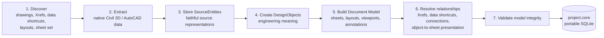

# CORE Architecture

## Boundaries

CORE is organized around five boundaries:

1. **Source adapters** read Civil 3D and, later, other structured or document sources.
2. **Canonical-model creation** discovers and faithfully records the project, then builds source-independent engineering and document models.
3. **Relationship resolution** preserves Xref lineage and transforms while connecting design objects, documents, and presentations.
4. **Review engine** runs later against a completed canonical project, using deterministic checks first and optional AI-assisted interpretation only where needed.
5. **Evidence and review** stores findings, supporting evidence, status, and engineer disposition in a review store that is separate from the canonical snapshot and persists across snapshots.

## Canonical-file creation

Creating a `.core` file is an import and modeling workflow, not an engineering review. Its result is a portable SQLite canonical project file that can be reviewed repeatedly without re-reading every DWG.

For Civil 3D, the exporter first creates a faithful [`.corex` exchange package](docs/COREX.md). The CORE importer then performs the creation workflow below; CORE itself does not parse DWG files.



### 1. Discover

Starting from a selected drawing, folder, or sheet set, identify the project drawings, layouts, sheet set, the complete Xref dependency tree, and all Civil 3D data-shortcut references. Xrefs and data-shortcut sources remain separate source drawings; they are never flattened. Each dependency records its saved path, resolved path, and resolution status, so a reference that is broken on the reviewer's machine is visible.

### 2. Extract

Read native Civil 3D and AutoCAD data from each discovered source: intelligent Civil 3D objects, standard CAD entities, block definitions and references, layers, Xrefs, data-shortcut references, styles and their display components, layouts, viewports, profile views, annotations, and useful source metadata. Each drawing is read once, from its own database, even when it is referenced many times. This step collects facts; it does not run QC.

### 3. Store SourceEntities

A **SourceEntity** is CORE's faithful representation of something actually found in a source file. It retains the source system, native ID and type, source geometry and properties, source file, transform context, and extraction metadata. CORE preserves source lineage rather than replacing it with a simplified copy.

### 4. Create DesignObjects

A **DesignObject** adds engineering meaning to one or more SourceEntities. It stores classification, engineering relationships, normalized or derived values, and provenance. It refers back to source geometry and native properties instead of duplicating them unless CORE must retain genuinely derived geometry or values.

Creation prefers the most reliable available method:

1. **Deterministic native mapping** — for example, a Civil 3D pipe maps directly to a storm-pipe DesignObject.
2. **Rule-based inference** — for example, a polyline on a known utility layer is classified by an explicit project rule.
3. **AI inference as a fallback** — only when structured data and rules cannot determine the meaning. AI-created mappings carry method, confidence, and supporting provenance.

AI inference can be disabled for an import. A snapshot records whether AI was enabled and, if so, the model and version used, so an import without AI is fully reproducible from its `.corex`.

A data-shortcut reference and its source object become one DesignObject, not two.

### 5. Build the Document Model

Build a separate model for sheets, layouts, viewports, profile views, title blocks, notes, labels, and other annotations. The Document Model describes how the project is presented; it is not a duplicate of the Design Model.

A layout, the logical sheet it produces (sheet number, title, revision), and a published rendition of that sheet (a PDF page) are distinct entities. Civil 3D view frames and match lines are recorded as the intended coverage of each sheet.

### 6. Resolve relationships

Connect the parts into a project graph: nested Xref chains and transforms, block-reference transforms, data-shortcut references, design-object connections such as pipe-to-structure, and the presentation of an object on a sheet through a layout and viewport.

Presentation distinguishes an object located inside a viewport from one actually visible in it. Visibility is resolved from:

- Layer state: drawing-wide, per-viewport, and host overrides of Xref layers (subject to `VISRETAIN`).
- Effective layer: entities on layer `0` inside a block take on the block reference's layer.
- Civil 3D style display components: each component has its own layer and visibility per view direction.
- Xref attachment type (overlays are not visible through a parent) and Xref or block clip boundaries.

When an object is not visible, the reason is recorded.

### 7. Validate and save

Confirm that identities are unique, references resolve, Xref and viewport transforms are valid, units and coordinate references are known or explicitly marked unknown, DesignObjects trace to SourceEntities, and document links point to valid layouts and sheets. Save the validated project as a portable SQLite `.core` file.

A saved `.core` file is an immutable snapshot. Re-exporting the project produces a new snapshot rather than modifying an existing one.

## QC happens after canonical-model creation

```text
Civil 3D project -> canonical-file creation -> project.core -> QC engine -> project.corereview
```

The QC engine is deliberately separate. It may run different rules, or rerun the same rules, against the same `.core` file without changing source extraction or confusing import facts with review conclusions.

Every rule execution is recorded as a rule run with the rule version, parameter profile, tolerances, and snapshot checksum, so any finding can be reproduced.

Every observation and finding records its basis: `native`, `rule`, or `ai`, taken from the least-certain mapping among its inputs. A deterministic rule applied to AI-inferred objects produces an `ai`-basis finding.

The source remains authoritative for source facts. CORE-derived facts must be labeled as derived and traceable to their inputs.

## Review across submittals

Projects are reviewed more than once. Findings, evidence, and engineer dispositions live in a review store (`.corereview`) that references snapshots by checksum and entities by stable identity. When a new snapshot is reviewed:

- Findings that match an earlier finding by stable identity keep their disposition history.
- Findings matched only by fallback (type, name, location) are flagged for the engineer to confirm.
- Earlier findings with no match are marked resolved-by-change, not deleted.
- Differences between snapshots (objects added, removed, or changed) can be reported directly.

See [ADR-009](docs/adr/ADR-009-identity-and-review-lifecycle.md).

## Local-first deployment

The initial runtime is a local application backed by SQLite. Files remain under the user's control. External services may be added later behind explicit adapters, but they must not be prerequisites for inspecting an imported project or its findings.

## Design and Document models

The Design model captures structured engineering entities and their relationships. The Document model captures sheets, layouts, viewports, PDFs, calculations, specifications, and other review artifacts. They are separate because their identities, geometry, and lifecycle differ; cross-links connect them where evidence or review requires it.

See the [diagram set](docs/diagrams/README.md) and [ADRs](docs/adr/README.md) for the decisions behind this structure.
