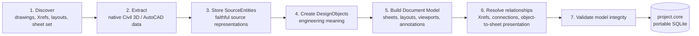

# CORE Architecture

## Boundaries

CORE is organized around five boundaries:

1. **Source adapters** read Civil 3D and, later, other structured or document sources.
2. **Canonical-model creation** discovers and faithfully records the project, then builds source-independent engineering and document models.
3. **Relationship resolution** preserves Xref lineage and transforms while connecting design objects, documents, and presentations.
4. **Review engine** runs later against a completed canonical project, using deterministic checks first and optional AI-assisted interpretation only where needed.
5. **Evidence and review** stores findings, supporting evidence, status, and engineer disposition.

## Canonical-file creation

Creating a `.core` file is an import and modeling workflow, not an engineering review. Its result is a portable SQLite canonical project file that can be reviewed repeatedly without re-reading every DWG.

For Civil 3D, the exporter first creates a faithful [`.corex` exchange package](docs/COREX.md). The CORE importer then performs the creation workflow below; CORE itself does not parse DWG files.



### 1. Discover

Starting from a selected drawing, folder, or sheet set, identify the project drawings, layouts, sheet set, and complete Xref dependency tree. Xrefs remain separate source drawings; they are never flattened.

### 2. Extract

Read native Civil 3D and AutoCAD data from each discovered source: intelligent Civil 3D objects, standard CAD entities, layers, Xrefs, layouts, viewports, annotations, and useful source metadata. This step collects facts; it does not run QC.

### 3. Store SourceEntities

A **SourceEntity** is CORE's faithful representation of something actually found in a source file. It retains the source system, native ID and type, source geometry and properties, source file, transform context, and extraction metadata. CORE preserves source lineage rather than replacing it with a simplified copy.

### 4. Create DesignObjects

A **DesignObject** adds engineering meaning to one or more SourceEntities. It stores classification, engineering relationships, normalized or derived values, and provenance. It refers back to source geometry and native properties instead of duplicating them unless CORE must retain genuinely derived geometry or values.

Creation prefers the most reliable available method:

1. **Deterministic native mapping** — for example, a Civil 3D pipe maps directly to a storm-pipe DesignObject.
2. **Rule-based inference** — for example, a polyline on a known utility layer is classified by an explicit project rule.
3. **AI inference as a fallback** — only when structured data and rules cannot determine the meaning. AI-created mappings carry method, confidence, and supporting provenance.

### 5. Build the Document Model

Build a separate model for sheets, layouts, viewports, title blocks, notes, labels, and other annotations. The Document Model describes how the project is presented; it is not a duplicate of the Design Model.

### 6. Resolve relationships

Connect the parts into a project graph: nested Xref chains and transforms, design-object connections such as pipe-to-structure, and the presentation of an object on a sheet through a layout and viewport.

### 7. Validate and save

Confirm that identities are unique, references resolve, Xref and viewport transforms are valid, DesignObjects trace to SourceEntities, and document links point to valid layouts and sheets. Save the validated project as a portable SQLite `.core` file.

## QC happens after canonical-model creation

```text
Civil 3D project -> canonical-file creation -> project.core -> QC engine -> findings
```

The QC engine is deliberately separate. It may run different rules, or rerun the same rules, against the same `.core` file without changing source extraction or confusing import facts with review conclusions.

The source remains authoritative for source facts. CORE-derived facts must be labeled as derived and traceable to their inputs.

## Local-first deployment

The initial runtime is a local application backed by SQLite. Files remain under the user's control. External services may be added later behind explicit adapters, but they must not be prerequisites for inspecting an imported project or its findings.

## Design and Document models

The Design model captures structured engineering entities and their relationships. The Document model captures sheets, layouts, viewports, PDFs, calculations, specifications, and other review artifacts. They are separate because their identities, geometry, and lifecycle differ; cross-links connect them where evidence or review requires it.

See the [diagram set](docs/diagrams/README.md) and [ADRs](docs/adr/README.md) for the decisions behind this structure.
