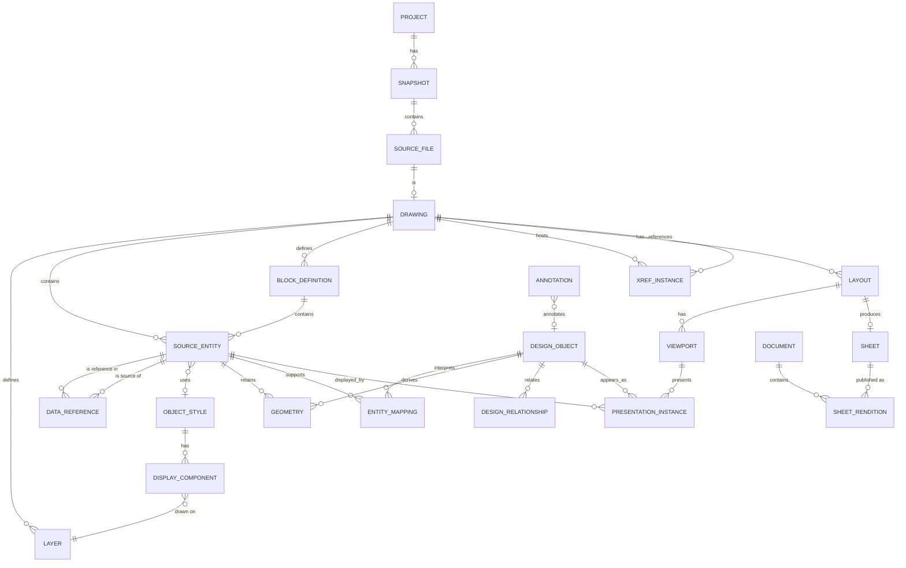
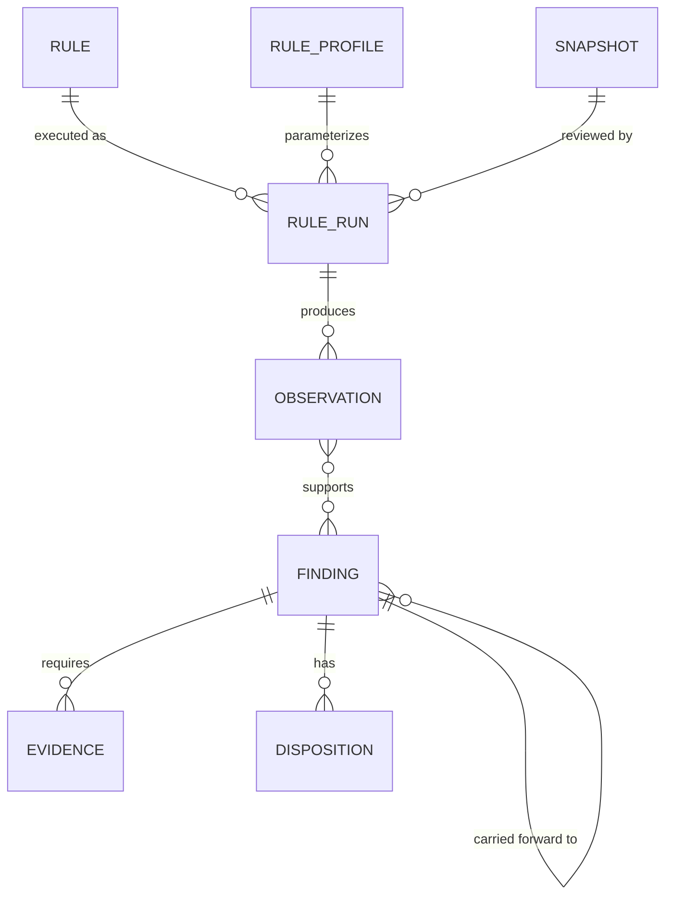

# CORE Data Model

## Canonical snapshot (`.core`)

```mermaid
erDiagram
  PROJECT ||--o{ SNAPSHOT : has
  SNAPSHOT ||--o{ SOURCE_FILE : contains
  SOURCE_FILE ||--o| DRAWING : is
  DRAWING ||--o{ LAYER : defines
  DRAWING ||--o{ SOURCE_ENTITY : contains
  DRAWING ||--o{ BLOCK_DEFINITION : defines
  BLOCK_DEFINITION ||--o{ SOURCE_ENTITY : contains
  DRAWING ||--o{ XREF_INSTANCE : hosts
  XREF_INSTANCE }o--|| DRAWING : references
  SOURCE_ENTITY ||--o{ DATA_REFERENCE : "is reference in"
  SOURCE_ENTITY ||--o{ DATA_REFERENCE : "is source of"
  OBJECT_STYLE ||--o{ DISPLAY_COMPONENT : has
  DISPLAY_COMPONENT }o--|| LAYER : "drawn on"
  SOURCE_ENTITY }o--o| OBJECT_STYLE : uses
  SOURCE_ENTITY ||--o{ GEOMETRY : retains
  SOURCE_ENTITY ||--o{ ENTITY_MAPPING : supports
  DESIGN_OBJECT ||--o{ ENTITY_MAPPING : interprets
  DESIGN_OBJECT ||--o{ GEOMETRY : derives
  DESIGN_OBJECT ||--o{ DESIGN_RELATIONSHIP : relates
  DRAWING ||--o{ LAYOUT : has
  LAYOUT ||--o{ VIEWPORT : has
  LAYOUT ||--o| SHEET : produces
  SHEET ||--o{ SHEET_RENDITION : "published as"
  DOCUMENT ||--o{ SHEET_RENDITION : contains
  VIEWPORT ||--o{ PRESENTATION_INSTANCE : presents
  DESIGN_OBJECT ||--o{ PRESENTATION_INSTANCE : appears_as
  SOURCE_ENTITY ||--o{ PRESENTATION_INSTANCE : displayed_by
  ANNOTATION }o--o| DESIGN_OBJECT : annotates
```

## Review store (`.corereview`)

```mermaid
erDiagram
  RULE ||--o{ RULE_RUN : "executed as"
  RULE_PROFILE ||--o{ RULE_RUN : parameterizes
  SNAPSHOT ||--o{ RULE_RUN : "reviewed by"
  RULE_RUN ||--o{ OBSERVATION : produces
  OBSERVATION }o--o{ FINDING : supports
  FINDING ||--o{ EVIDENCE : requires
  FINDING ||--o{ DISPOSITION : has
  FINDING ||--o{ FINDING : "carried forward to"
```
