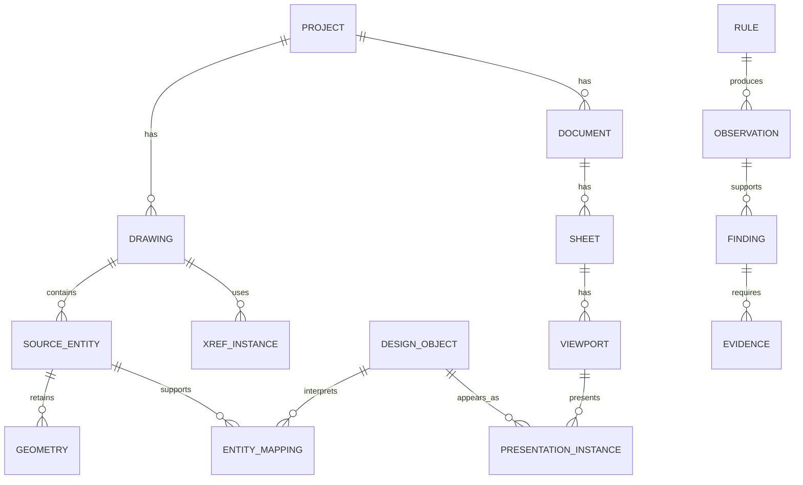

# CORE Data Model

```mermaid
erDiagram
  PROJECT ||--o{ DRAWING : has
  PROJECT ||--o{ DOCUMENT : has
  DRAWING ||--o{ SOURCE_ENTITY : contains
  DRAWING ||--o{ XREF_INSTANCE : uses
  SOURCE_ENTITY ||--o{ GEOMETRY : retains
  SOURCE_ENTITY ||--o{ ENTITY_MAPPING : supports
  DESIGN_OBJECT ||--o{ ENTITY_MAPPING : interprets
  DOCUMENT ||--o{ SHEET : has
  SHEET ||--o{ VIEWPORT : has
  DESIGN_OBJECT ||--o{ PRESENTATION_INSTANCE : appears_as
  VIEWPORT ||--o{ PRESENTATION_INSTANCE : presents
  RULE ||--o{ OBSERVATION : produces
  OBSERVATION ||--o{ FINDING : supports
  FINDING ||--o{ EVIDENCE : requires
```
