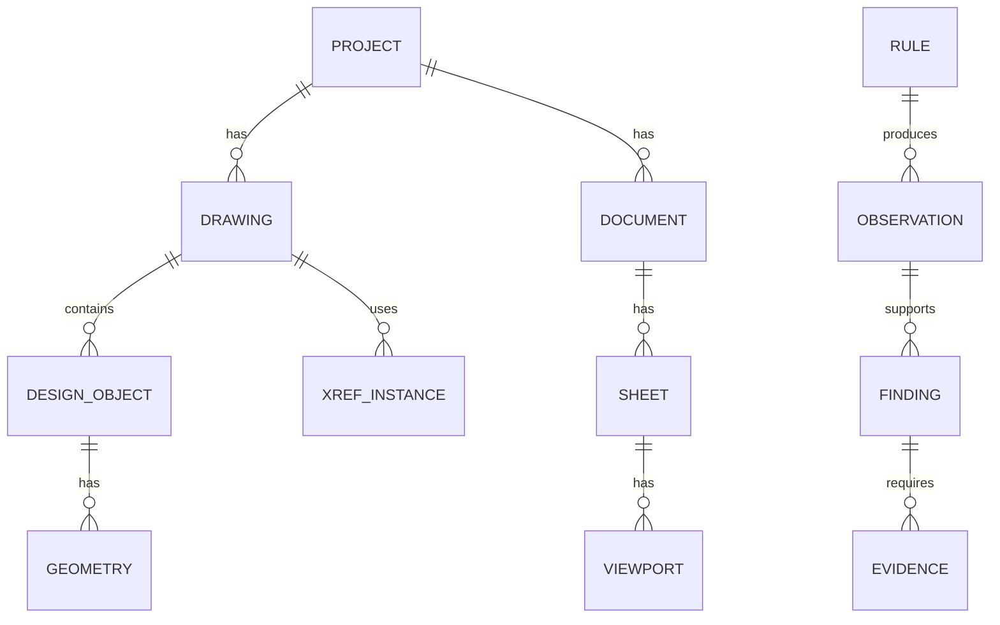

# CORE Data Model

```mermaid
erDiagram
  PROJECT ||--o{ DRAWING : has
  PROJECT ||--o{ DOCUMENT : has
  DRAWING ||--o{ DESIGN_OBJECT : contains
  DRAWING ||--o{ XREF_INSTANCE : uses
  DESIGN_OBJECT ||--o{ GEOMETRY : has
  DOCUMENT ||--o{ SHEET : has
  SHEET ||--o{ VIEWPORT : has
  RULE ||--o{ OBSERVATION : produces
  OBSERVATION ||--o{ FINDING : supports
  FINDING ||--o{ EVIDENCE : requires
```
