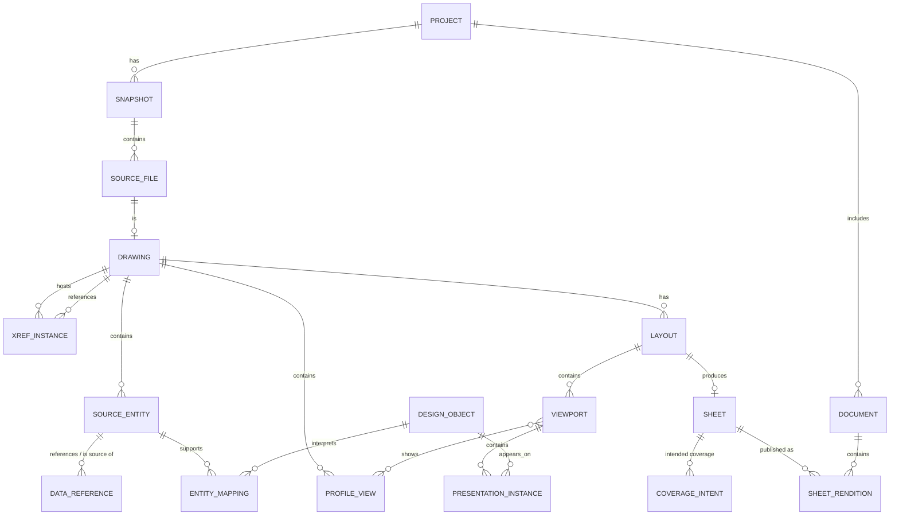

# Project, Drawing, and Sheet Model

```mermaid
erDiagram
  PROJECT ||--o{ SNAPSHOT : has
  SNAPSHOT ||--o{ SOURCE_FILE : contains
  SOURCE_FILE ||--o| DRAWING : is
  PROJECT ||--o{ DOCUMENT : includes
  DRAWING ||--o{ XREF_INSTANCE : hosts
  XREF_INSTANCE }o--|| DRAWING : references
  DRAWING ||--o{ SOURCE_ENTITY : contains
  SOURCE_ENTITY ||--o{ DATA_REFERENCE : "references / is source of"
  SOURCE_ENTITY ||--o{ ENTITY_MAPPING : supports
  DESIGN_OBJECT ||--o{ ENTITY_MAPPING : interprets
  DRAWING ||--o{ LAYOUT : has
  LAYOUT ||--o{ VIEWPORT : contains
  DRAWING ||--o{ PROFILE_VIEW : contains
  VIEWPORT }o--o{ PROFILE_VIEW : shows
  LAYOUT ||--o| SHEET : produces
  SHEET ||--o{ COVERAGE_INTENT : "intended coverage"
  SHEET ||--o{ SHEET_RENDITION : "published as"
  DOCUMENT ||--o{ SHEET_RENDITION : contains
  VIEWPORT ||--o{ PRESENTATION_INSTANCE : contains
  DESIGN_OBJECT ||--o{ PRESENTATION_INSTANCE : appears_on
```
