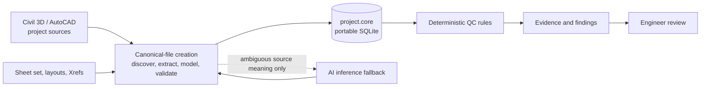

# System Overview

```mermaid
flowchart LR
  C3D["Civil 3D / AutoCAD\nproject sources"] --> I["Canonical-file creation\ndiscover, extract, model, validate"]
  SS["Sheet set, layouts, Xrefs"] --> I
  I --> M[("project.core\nportable SQLite")]
  M --> D["Deterministic QC rules"]
  D --> E["Evidence and findings"]
  E --> R["Engineer review"]
  I -. ambiguous source meaning only .-> AI["AI inference fallback"]
  AI --> I
```
