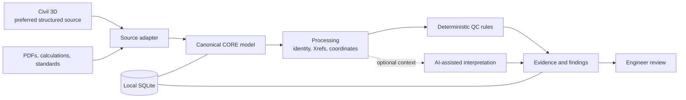

# System Overview

```mermaid
flowchart LR
  C3D["Civil 3D\npreferred structured source"] --> A["Source adapter"]
  DOC["PDFs, calculations, standards"] --> A
  A --> M["Canonical CORE model"]
  M --> P["Processing\nidentity, Xrefs, coordinates"]
  P --> D["Deterministic QC rules"]
  D --> E["Evidence and findings"]
  E --> R["Engineer review"]
  P -. optional context .-> AI["AI-assisted interpretation"]
  AI --> E
  DB[("Local SQLite")] --- M
  DB --- E
```
