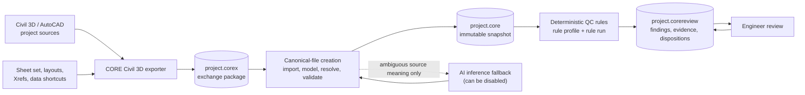

# System Overview

```mermaid
flowchart LR
  C3D["Civil 3D / AutoCAD\nproject sources"] --> X["CORE Civil 3D exporter"]
  SS["Sheet set, layouts,\nXrefs, data shortcuts"] --> X
  X --> CX[("project.corex\nexchange package")]
  CX --> I["Canonical-file creation\nimport, model, resolve, validate"]
  I --> M[("project.core\nimmutable snapshot")]
  M --> D["Deterministic QC rules\nrule profile + rule run"]
  D --> RS[("project.corereview\nfindings, evidence, dispositions")]
  RS --> R["Engineer review"]
  R --> RS
  I -. ambiguous source meaning only .-> AI["AI inference fallback\n(can be disabled)"]
  AI --> I
```
