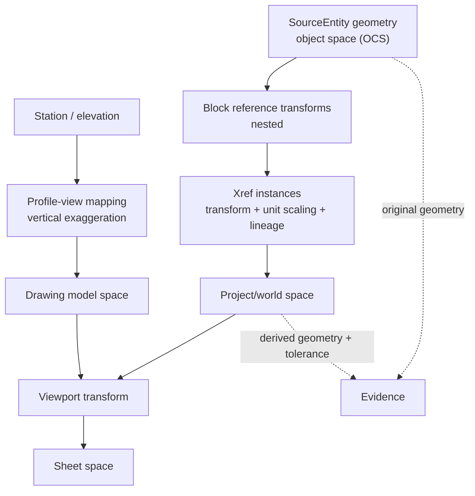

# Xref and Coordinate Transformation

```mermaid
flowchart TD
  O["SourceEntity geometry\nobject space (OCS)"] --> B["Block reference transforms\nnested"]
  B --> X["Xref instances\ntransform + unit scaling + lineage"] --> W["Project/world space"]
  W --> V["Viewport transform"] --> S["Sheet space"]
  PV["Station / elevation"] --> P["Profile-view mapping\nvertical exaggeration"] --> M["Drawing model space"] --> V
  O -. original geometry .-> E["Evidence"]
  W -. derived geometry + tolerance .-> E
```

Coordinates are 64-bit and units are explicit at every step; see [COORDINATES.md](../../COORDINATES.md).
