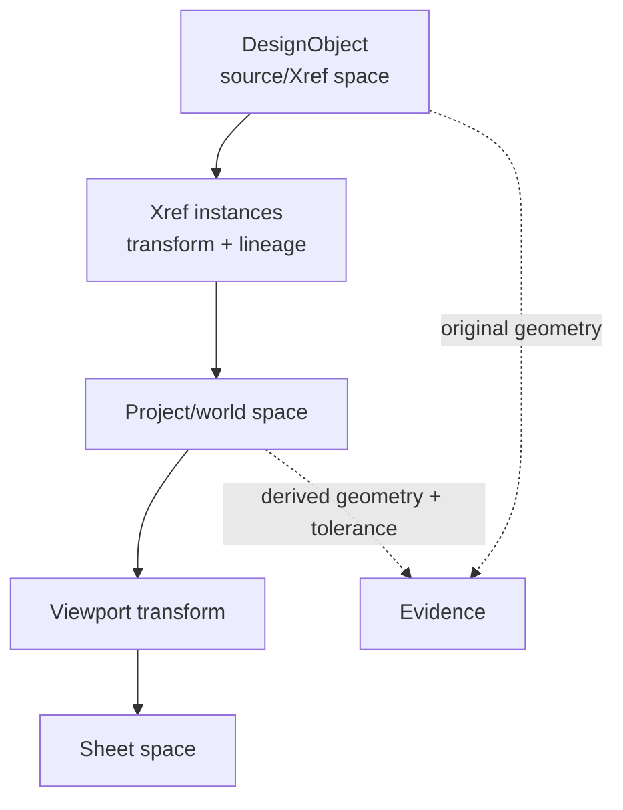

# Xref and Coordinate Transformation

```mermaid
flowchart TD
  O["DesignObject\nsource/Xref space"] --> X["Xref instances\ntransform + lineage"] --> W["Project/world space"]
  W --> V["Viewport transform"] --> S["Sheet space"]
  O -. original geometry .-> E["Evidence"]
  W -. derived geometry + tolerance .-> E
```
